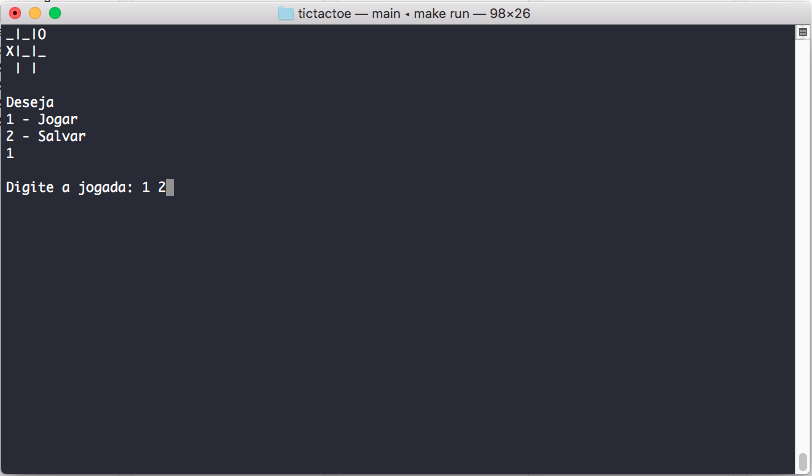

# Tic tac toe



OVERVIEW
--------------------------------------------------
This is an implementation of a tic tac toe game for the [Introduction to Computer Science I
][ICC1] course. It was made at the Computer Science course (ICMC - USP).

BUILD AND INSTALL
--------------------------------------------------

Clone Tic Tac Toe repository:

```bash
  $ git clone https://github.com/wesjrock/tictactoe.git
```

Run Tic Tac Toe with:

```bash
  $ make
  $ make run
```

HOW TO PLAY
--------------------------------------------------

```bash
  You can choose between two modes
	* PLAYERS vs PLAYER
	* PLAYER vs CPU
	
	If you choose PLAYER vs CPU, you can select between three difficulty modes:
	* Easy
	* Medium
	* Hard
	
	To play the game you have to type the row and column number (The first row and column are 0 0)
	
	There's also a SAVE and LOAD option (These were made to practice File I/O)
```

You can find more information about the game and the assignment in the files: `assignment report.pdf` and `presentation.pptx`
